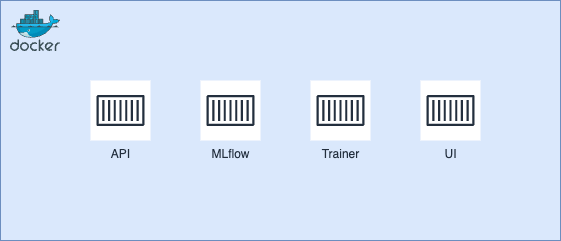

# 🏠 Predykcja cen nieruchomości w Polsce (powiaty)

Projekt przedstawia kompletny pipeline analityczno-modelowy do **predykcji cen nieruchomości w Polsce na poziomie powiatów w ujęciu kwartalnym**, zbudowany w oparciu o dane publiczne (NBP, GUS) oraz dobre praktyki MLOps.

Celem projektu jest:
- przygotowanie danych ekonomicznych i rynkowych,
- wytrenowanie modelu ML,
- zapis i wersjonowanie wyników,
- wizualizacja predykcji na mapie Polski.

Projekt działa lokalnie w oparciu o **Docker Compose**.

## 🧱 Architektura projektu (high level)

Pipeline składa się z czterech głównych warstw:

1. **Batch training (trainer)** – przygotowanie danych i trening modelu
2. **Experiment tracking (MLflow)** – metryki, parametry, modele
3. **Serving (API)** – udostępnienie wyników do UI
4. **Visualization (UI)** – mapa powiatów z cenami nieruchomości

Każda warstwa działa w osobnym kontenerze.

## 🧩 Komponenty systemu

System składa się z kilku niezależnych komponentów, z których każdy odpowiada za inny etap pipeline’u danych i modelu. Taki podział zapewnia czytelność architektury oraz zgodność z dobrymi praktykami MLOps.

---

### 1️⃣ Trainer (batch job ML)
**Katalog:** `trainer/`  
**Technologie:** Python, scikit-learn, MLflow  

Komponent `trainer` odpowiada za cały proces uczenia modelu i jest uruchamiany jako jednorazowy batch job (kontener).

Zakres odpowiedzialności:
- wczytanie danych źródłowych (ceny nieruchomości, inflacja, bezrobocie itp.),
- przygotowanie i scalanie danych (ETL, feature engineering),
- trening modelu predykcyjnego,
- walidację czasową modelu,
- obliczenie metryk jakości (RMSE, MAE, R²),
- zapis modelu i metryk do MLflow,
- eksport predykcji do plików CSV wykorzystywanych przez warstwę wizualizacji.

Trainer **nie działa w sposób ciągły** – jest uruchamiany ręcznie lub cyklicznie i kończy działanie po zakończeniu treningu.

---

### 2️⃣ MLflow (zarządzanie eksperymentami)
**Katalog:** `mlflow/`  
**Technologie:** MLflow, PostgreSQL, MinIO  

MLflow pełni rolę warstwy MLOps odpowiedzialnej za zarządzanie eksperymentami uczenia maszynowego.

Zakres odpowiedzialności:
- rejestrowanie uruchomień treningu (runów),
- zapisywanie parametrów modeli i metryk jakości,
- przechowywanie artefaktów (modele, wykresy, raporty),
- umożliwienie porównywania różnych wersji modeli.

MLflow działa jako osobny serwis dostępny przez przeglądarkę i **nie jest bezpośrednio wykorzystywany przez UI**, a jedynie przez komponent `trainer`.

---

### 3️⃣ API (warstwa serwująca dane)
**Katalog:** `api/`  
**Technologie:** FastAPI  

Komponent API odpowiada za udostępnienie wyników predykcji w ustandaryzowanej formie.

Zakres odpowiedzialności:
- odczyt plików z predykcjami wygenerowanych przez trainer,
- wystawienie endpointów REST umożliwiających pobranie danych,
- separację logiki modelu od warstwy wizualizacji.

API **nie trenuje modelu** i **nie wykonuje predykcji online** – jego zadaniem jest wyłącznie serwowanie gotowych wyników.

---

### 4️⃣ UI (warstwa wizualizacji)
**Katalog:** `ui/`  
**Technologie:** Streamlit, PyDeck  

Komponent UI odpowiada za prezentację wyników modelu w formie interaktywnej mapy Polski.

Zakres odpowiedzialności:
- pobieranie danych z API,
- wczytanie pliku GeoJSON z granicami powiatów,
- wizualizacja predykcji cen nieruchomości na mapie (choropleth),
- podstawowa eksploracja danych przez użytkownika.

UI jest **cienkim klientem wizualnym** i nie zawiera logiki biznesowej ani modelowej.

---

### 5️⃣ Docker Compose (orkiestracja lokalna)
**Plik:** `docker-compose.yml`  

Docker Compose odpowiada za:
- uruchamianie wszystkich komponentów w spójnym środowisku,
- konfigurację połączeń między serwisami,
- zarządzanie wolumenami danych,
- zapewnienie powtarzalności uruchomienia projektu.

Docker Compose pełni rolę lekkiego orkiestratora lokalnego i zastępuje bardziej złożone rozwiązania (np. Kubernetes), które w tym projekcie nie są wymagane.

---

## 🔄 Przepływ danych w systemie

1. Dane źródłowe trafiają do katalogu `data/raw/`.
2. Trainer przetwarza dane i trenuje model.
3. Wyniki treningu są zapisywane:
   - do MLflow (metryki, model),
   - do `data/published/` (predykcje w formacie CSV).
4. API udostępnia dane z `data/published/`.
5. UI pobiera dane z API i prezentuje je na mapie.

---

